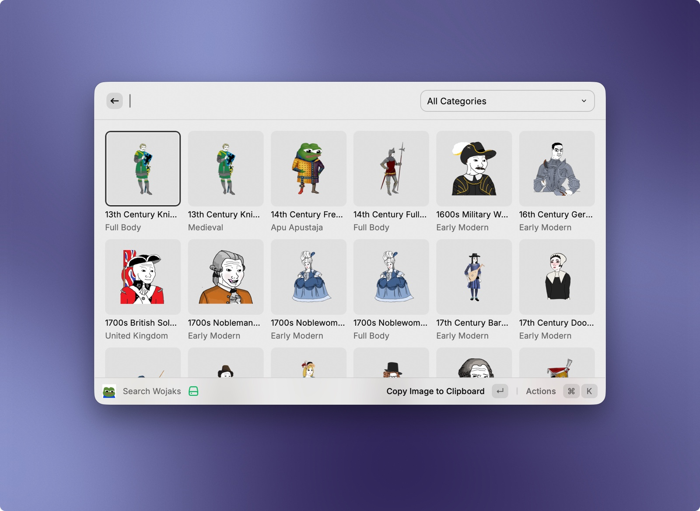
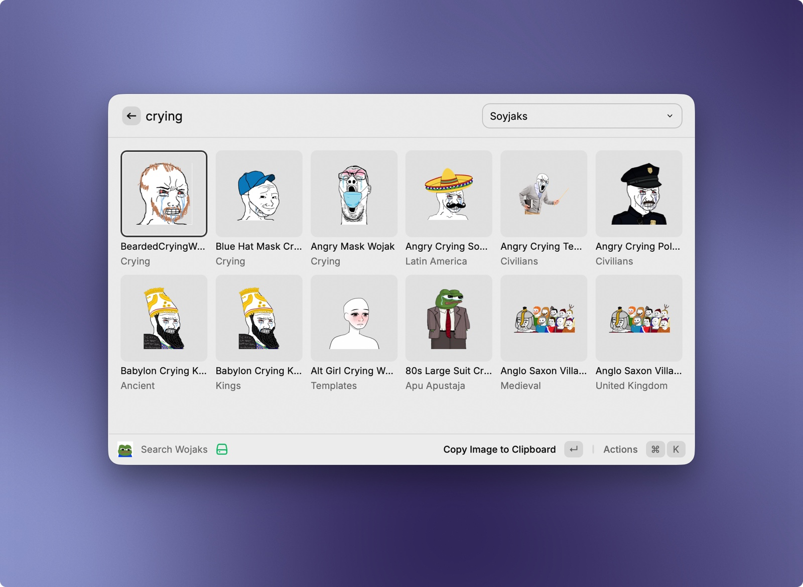

# Wojak Picker

Browse, search, and copy Wojaks straight into any chat from Raycast.

## Features

- Fast grid browsing with lazy loading
- Fuzzy search across thousands of Wojaks
- One-key copy to clipboard for chats and messages
- Supabase-backed image hosting so it works on any machine
- Local metadata and image caching for smoother repeat use

## Usage

Open Raycast and run `Search Wojaks`.

- Browse the grid to discover Wojaks quickly
- Search by name, filename, or category
- Press `Enter` to copy the selected image to your clipboard
- Use `Cmd+O` to open the source image in the browser
- Use `Cmd+Shift+C` to copy the source image URL

## Development Notes

- Configure `Supabase URL` and `Supabase Anon Key` in the extension preferences before first use.
- The extension reads from your configured Supabase project and bucket.
- Search metadata is cached for 24 hours in Raycast LocalStorage.
- Copied images are cached locally in Raycast support storage after first download.
- Project maintenance scripts like scraping and Supabase migration are for repository maintenance only.
